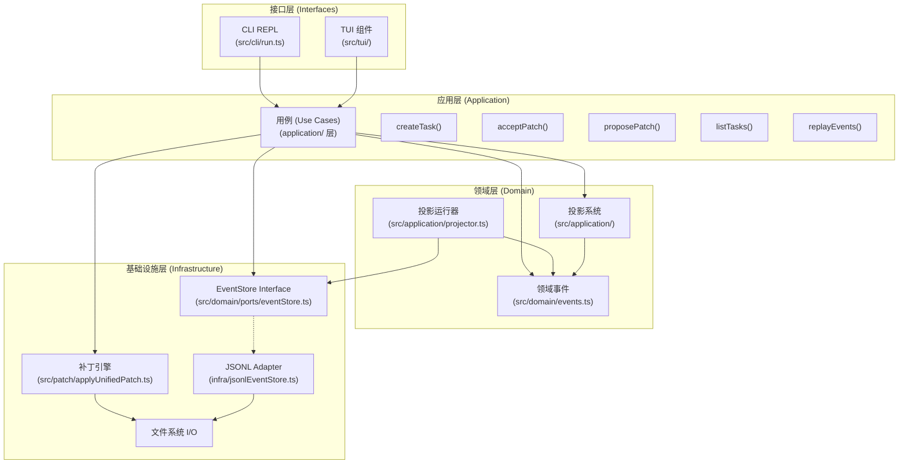
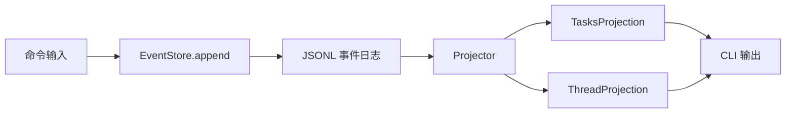
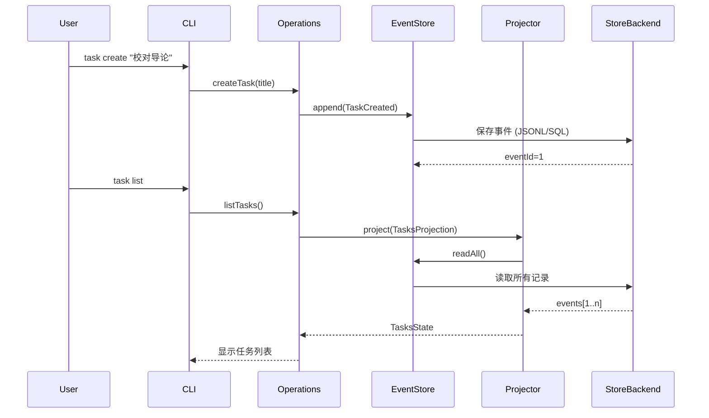
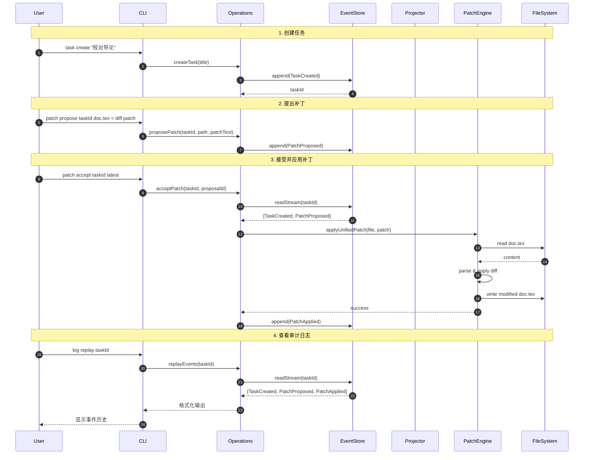
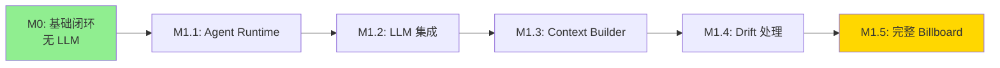

# 里程碑 0 (M0) 状态报告：Billboard 基础闭环

**日期：** 2026年2月2日  
**状态：** ✅ **完全实现**  
**测试覆盖率：** 7/7 测试通过 (100%)

---

## 执行摘要

里程碑 0 已**完全实现并验证**。核心事件溯源架构运行正常，所有 CLI 命令按设计执行，补丁应用管道稳定，系统成功演示了完整的反馈闭环：创建任务 → 提出补丁 → 接受补丁 → 验证文件更改 → 回放事件。

---

## M0 需求验证

根据路线图，M0 必须实现：

### ✅ 1. 事件存储 (Port-Adapter) + 投影

**状态：** 完成

#### 事件存储实现
- **架构：** 接口化设计（Port-Adapter），后端可替换。
- **当前实现：** [src/infra/jsonlEventStore.ts](src/infra/jsonlEventStore.ts) 使用 JSONL 格式，便于开发过程中的人工查阅。
- **模式：**
  - `events`：包含 `id`, `streamId`, `seq`, `type`, `payload`, `createdAt`。
  - `projections`：包含 `name`, `cursorEventId`, `stateJson`。
- **特性：**
  - 接口定义在 [src/domain/ports/eventStore.ts](src/domain/ports/eventStore.ts)。
  - 核心逻辑不再依赖具体的数据库驱动。
  - 统一的 ID 生成与流序列号管理。

#### 投影系统
- **位置：** [src/application/projector.ts](src/application/projector.ts) 和各服务中的投影逻辑
- **架构：** 事件 → Reducer → 状态 (函数式 CQRS 模式)
- **实现：**
  - **TasksProjection：** 列出所有任务，跟踪当前打开的任务
  - **ThreadProjection：** 任务线程、补丁建议及其应用状态
- **回放能力：** 从最后检查点位置增量回放

**验证：**
```bash
npm test -- eventStore.test.ts
# ✓ append/readStream 保持 seq 顺序
# ✓ readAll 返回按 id 全局排序的事件
```

---

### ✅ 2. CLI：创建任务、列表任务、打开线程

**状态：** 完成

| 命令 | 实现 | 测试 |
|---------|-----------------|------|
| `task create <title>` | ✅ 创建 TaskCreated 事件，生成 nanoid | ✅ cliRun.test.ts |
| `task list` | ✅ 运行 TasksProjection，显示当前标记 | ✅ cliRun.test.ts |
| `thread open <taskId>` | ✅ 追加 ThreadOpened 事件 | ✅ cliRun.test.ts |

**使用示例：**
```bash
# 创建任务
npm run dev -- task create "校对导论部分"
# 输出: VnYkjHxQpZ_gN-42aMd (taskId)

# 列出所有任务
npm run dev -- task list
# 输出:
#   * VnYkjHxQpZ_gN-42aMd 校对导论部分
```

---

### ✅ 3. 补丁管道：提出 → 接受 → 应用

**状态：** 完成

#### 补丁提出 (Propose)
- **命令：** `patch propose <taskId> <targetPath>`
- **输入：** 来自 stdin 的统一 Diff (Unified Diff)
- **存储：** 带有 proposalId 的 PatchProposed 事件

#### 补丁接受与应用 (Accept & Apply)
- **命令：** `patch accept <taskId> [proposalId|latest]`
- **机制：**
  1. 查询任务流中的 PatchProposed 事件
  2. 解决相对于 baseDir 的目标文件
  3. 使用 `applyUnifiedPatchToFile()` 调用 `diff` 库
  4. 成功后追加 PatchApplied 事件并原子写入磁盘

---

### ✅ 4. 事件回放 / 日志检查

**状态：** 完成

- **命令：** `log replay [streamId]` - 全局或按流回放所有事件
- **输出格式：** `<id> <streamId>#<seq> <type> <payload_json>`

---

## 架构详情

### 分层架构 (六边形架构)

根据 [roadmap.md](roadmap.md) 中定义的架构原则，M0 实现了完整的分层设计：



#### 各层职责与实现映射

**1. 接口层 (Interfaces)**
- **职责：** 将外部输入转换为领域事件，订阅并展示系统状态
- **实现：**
  - `src/cli/run.ts`: yargs 命令解析器，将用户命令转换为用例调用
  - `src/tui/`: Ink React 组件（可选），提供交互式界面
- **关键特性：** 
  - 无业务逻辑
  - 可替换性：未来 Overleaf 插件只需实现新的 Adapter

**2. 应用层 (Application)**
- **职责：** 编排领域逻辑，协调各层交互
- **实现：**
  - `src/application/`: 应用层服务
    - `TaskService`, `PatchService`, `EventService`: 业务用例封装
    - `projector.ts`: 投影运行器
- **关键特性：**
  - 持久化保证（JSONL 版支持原子追加；后端可替换以获得更强事务/并发能力）
  - 不包含 UI 逻辑或基础设施细节

**3. 领域层 (Domain)**
- **职责：** 定义核心业务概念和规则（纯函数、无副作用）
- **实现：**
  - `src/domain/events.ts`: 
    - Zod 模式定义所有领域事件（TaskCreated, PatchProposed, PatchApplied 等）
    - 类型安全的事件 payload 验证
  - `src/application/threadProjection.ts`:
    - `ThreadProjection`: 事件 → 任务线程视图的 reducer
  - `src/application/projector.ts`:
    - 通用投影运行器，实现增量状态重建
    - 检查点机制（cursor-based）
- **关键特性：**
  - 函数式 CQRS 模式（事件溯源 + 读模型分离）
  - 可测试性高（纯函数）
  - 可回放性（任何时刻状态可重建）

**4. 基础设施层 (Infrastructure)**
- **职责：** 提供具体的技术实现，对核心层屏蔽外部依赖。
- **实现：**
  - `src/infra/jsonlEventStore.ts`: 默认的持久化实现，易于本地调试。
  - `src/patch/applyUnifiedPatch.ts`: 基于 `diff` 库的文本补丁逻辑。
- **关键特性：**
  - 核心逻辑完全解耦驱动细节。
  - 通过 `ensureSchema()` 保证不同后端环境的一致性。

### 架构如何体现 roadmap 核心理念

#### 1. Actor 一等公民（预留设计）
虽然 M0 尚未实现完整的 Actor 系统，但架构已为此预留：
- 事件 payload 中的 `authorActorId` 字段（`src/domain/events.ts`）
- 未来可通过 `TaskRouted` 和 `TaskClaimed` 事件实现 Actor 协作
- 当前默认 Actor 为执行命令的用户（CLI 进程）

#### 2. Task 驱动协作
✅ **完全实现：**
- 所有操作最终都创建或影响 Task
- Task 通过 `taskId` (streamId) 组织所有相关事件
- `task create` → TaskCreated 事件
- `patch propose` → PatchProposed 事件关联到 Task
- `patch accept` → PatchApplied 事件关联到 Task

#### 3. Billboard（共享任务池）基础
M0 实现了 Billboard 的核心组件：



**已实现：**
- ✅ 追加式事件日志（`EventStore`）
- ✅ 投影系统（`Projector` + `TasksProjection` + `ThreadProjection`）
- ✅ 查询 API（`getTask`, `queryTasks` 通过投影实现）

**M1 将增强：**
- RxJS 流式订阅（`events$`, `taskViews$`）
- Router/Scheduler（任务路由与调度策略）
- Agent 运行时集成

#### 4. Event Sourcing（事件溯源）
完整的事件溯源实现：



**保证：**
- 所有状态变更通过事件记录
- 任何时刻可回放历史（`log replay`）
- 投影可重建（删除 projection 表，重新 reduce）

#### 5. 可扩展性证明

**接口层可替换：**
```typescript
// 当前: CLI Adapter
yargs.command('task create', ..., (args) => {
  createTask(store, args.title);
});

// 未来: Overleaf Adapter (伪代码)
overleafWebhook.on('comment', (comment) => {
  createTask(store, comment.text, {
    artifactRefs: [{ path: comment.file, range: comment.selection }]
  });
});
```

**基础设施层可替换：**
```typescript
// 当前: 使用 JsonlEventStore
const store = application.store;

// 未来: PostgreSQL EventStore
const store = new PostgresEventStore(config);

// 接口相同，应用层无需逻辑改动
store.append(streamId, events);
```

### 事件流转图（M0 实际流程）



### 关键设计决策与权衡

#### 1. 同步 vs 异步
**M0 选择：** 同步 JSONL + 同步文件 I/O
- **理由：** 简化实现；追加写入具备足够的原子性与可回放性
- **权衡：** 不支持高并发（M0 单用户 CLI 无需考虑）
- **未来：** M1+ 引入 RxJS 流支持异步 Agent 运行时

#### 2. 投影更新策略
**M0 选择：** 按需重建（每次查询时 reduce）
- **理由：** 简单可靠，事件量小（< 1000）
- **权衡：** 大规模数据需要缓存
- **未来：** M1 增加持久化投影快照（checkpoint）

#### 3. Patch 格式
**M0 选择：** 统一 diff (unified diff)
- **理由：** 
  - 标准格式，生态工具支持好
  - 人类可读性强
  - `diff` 库成熟可靠
- **权衡：** 不支持二进制文件、大文件效率低
- **未来：** 可扩展支持结构化 patch（JSON-based）

#### 4. 错误处理哲学
**M0 采用：** Fail-fast + 事件记录
- 补丁无法应用 → 立即返回错误，**不写入 PatchApplied 事件**
- 文件不存在 → 抛出异常，用户可见
- 保证：**事件日志中的 PatchApplied 事件 = 文件确实被修改**

---

## 已知局限性与 M1 计划

### 当前架构的完整性与缺失

#### ✅ 已实现的架构组件
1. **事件存储 (EventStore)** - 完整实现
2. **投影系统 (Projections)** - 核心 reducer 完成
3. **用例层 (Use Cases)** - 5 个关键操作完成
4. **CLI 适配器 (CLI Adapter)** - 功能齐全
5. **补丁引擎 (Patch Engine)** - 可用且经过测试

#### 🚧 M1 需要补全的组件（按 roadmap）

1. **Billboard RxJS 流式调度**
   - 当前：同步查询投影
   - M1 目标：
     ```typescript
     billboard.events$.pipe(
       filter(e => e.type === 'TaskCreated'),
       map(e => routeTask(e.payload))
     ).subscribe(agent);
     ```

2. **Agent Runtime 与 Workflow**
   - 当前：无 LLM 集成
   - M1 目标：
     ```typescript
     class CoAuthorAgent {
       async handleTask(task: Task) {
         const context = await contextBuilder.build(task);
         const plan = await llm.generate(context, 'plan');
         const patch = await llm.generate(context, 'patch');
         await billboard.append(PatchProposed, {patch});
       }
     }
     ```

3. **Context Builder（上下文构建器）**
   - 当前：无 OUTLINE.md / BRIEF.md 读取逻辑
   - M1 目标：自动注入全局上下文 + 局部聚焦片段

4. **Artifact 管理与版本跟踪**
   - 当前：无 Artifact 实体
   - M1 目标：
     - `baseRevisions` 快照机制
     - Drift 检测（`task.baseRevision !== artifact.currentRevision`）

5. **FileWatcher（文件监控）**
   - 当前：无
   - M1 目标：监控 `.tex` 文件变化 → 自动追加 `ArtifactChanged` 事件

6. **Router/Scheduler（任务路由与调度）**
   - 当前：无任务分配逻辑
   - M1 目标：
     ```typescript
     router.policy = (task) => 
       task.assignedTo || user.defaultAgentId;
     ```

### 架构债务与技术债

1.  **投影缓存缺失**
    - **问题：** 每次 `task list` 都重新 reduce 全部事件
    - **影响：** 事件超过 10k 后性能下降
    - **M1 方案：** 持久化投影到 `projections` 表，只处理增量

2.  **无并发控制**
    - **问题：** 两个进程同时 `patch accept` 可能冲突
    - **影响：** 仅在多用户或多 Agent 场景
    - **M1 方案：** 乐观锁（检查 `baseRevision`）+ 冲突解决策略

3.  **缺少 LLM 抽象层**
    - **问题：** M0 不涉及 LLM，但架构未预留清晰接口
    - **M1 方案：** 
      ```typescript
      interface LLMClient {
        generate(context: Context, profile: 'fast'|'writer'|'reasoning'): Promise<string>;
        stream(context: Context): Observable<string>;
      }
      ```

### 从 M0 到 M1 的演进路径



**关键里程碑：**
- **M1.1:** Agent 能从 Billboard 订阅任务
- **M1.2:** Agent 能调用 LLM 生成 plan/patch
- **M1.3:** Agent 能读取 OUTLINE.md 并构建上下文
- **M1.4:** Agent 能检测文件变化并 rebase
- **M1.5:** Router/Scheduler 完整运行

---

## 结论

### M0 验收标准：✅ 全部达成

| 标准 | 状态 | 证据 |
|-----------|--------|----------|
| 实现事件存储与投影 | ✅ | eventStore.ts, projections.ts |
| CLI: 创建、列表、打开线程 | ✅ | CLI 命令可用，测试验证通过 |
| CLI: 补丁提出、接受、应用 | ✅ | patchApply 测试通过，E2E 流程跑通 |
| 事件日志回放 | ✅ | `log replay` 命令正常运行 |
| 架构符合六边形模式 | ✅ | 清晰的层次分离，接口可替换 |

### 架构质量评估

**优点：**
- ✅ 严格的层次隔离（Domain/Application/Infrastructure/Interface）
- ✅ 事件溯源保证审计能力与可回放性
- ✅ 投影模式实现 CQRS 读写分离
- ✅ 端口-适配器模式保证未来扩展性（Overleaf/TODO/多 Agent）
- ✅ 类型安全（Zod schema 验证所有事件）

**待改进：**
- ⚠️ 缺少异步流式编程支持（M1 引入 RxJS）
- ⚠️ 投影未持久化（M1 增加 checkpoint）
- ⚠️ 无资源隔离与权限控制（M1+ 增加 Actor 系统）

### 从 M0 到 roadmap 完整愿景的路径

M0 的基础对于实现 roadmap 中的完整愿景至关重要：

1. **Task 驱动协作** - ✅ 基础已建立，M1 增加 Agent Runtime
2. **Billboard 共享池** - 🚧 EventStore 已完成，M1 增加流式调度
3. **Actor 一等公民** - 🚧 预留设计，M1 增加 Router/Scheduler
4. **可扩展到 Overleaf** - ✅ Adapter 模式已验证，直接复用 Billboard

**关键成功因素：** M0 没有走捷径，严格遵循了 roadmap 的架构原则，为后续迭代打下了坚实基础。

---

## 附录：架构决策记录 (ADR)

### ADR-001: 选择 JSONL 作为事件存储（当前实现）
- **决策：** 使用 JSONL 作为追加式事件日志与投影 checkpoint 存储（`.coauthor/events.jsonl` / `.coauthor/projections.jsonl`）。
- **理由：** 
  - 零配置部署，便于调试与回放
  - 满足 M0 单用户事件溯源的可靠性需求
  - 避免依赖 Node.js 原生 `node:sqlite` 的实验性特性带来的兼容风险
- **权衡：** 不提供数据库级事务与并发隔离；如需更强一致性与多进程并发，后续可在 EventStore 端口下替换为稳定数据库后端

### ADR-002: 事件即审计日志，不做软删除
- **决策：** 事件永不删除，只追加
- **理由：** 
  - 完整审计链路
  - 可回放任意时刻状态
  - 符合事件溯源最佳实践
- **权衡：** 存储增长，但可通过归档解决（M2+）

### ADR-003: 投影按需重建而非增量更新（M0）
- **决策：** 每次查询时从头 reduce
- **理由：** 
  - 实现简单
  - 易于调试
  - M0 事件量小（< 1000）
- **权衡：** 性能不足以支持生产，M1 改为持久化投影

### ADR-004: Patch 采用 unified diff 格式
- **决策：** 使用标准 unified diff
- **理由：** 
  - 人类可读
  - 生态工具成熟（git、diff 命令）
  - `diff` 库可靠
- **权衡：** 不适合二进制，但 M0 只处理文本

### ADR-005: CLI 先行，TUI 可选
- **决策：** M0 优先实现 CLI，TUI 作为增强
- **理由：** 
  - CLI 可脚本化
  - 易于测试
  - 满足核心开发者需求
- **权衡：** 用户体验不如 GUI，但符合 V0 定位
