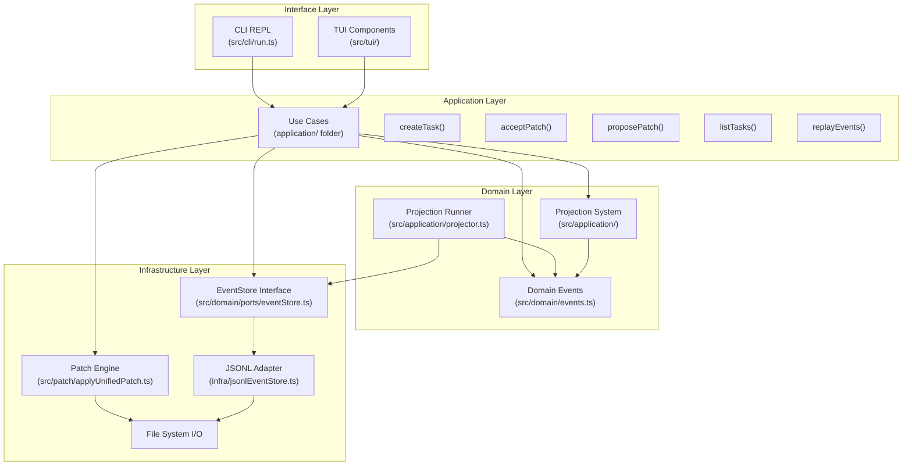
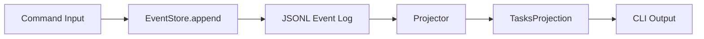
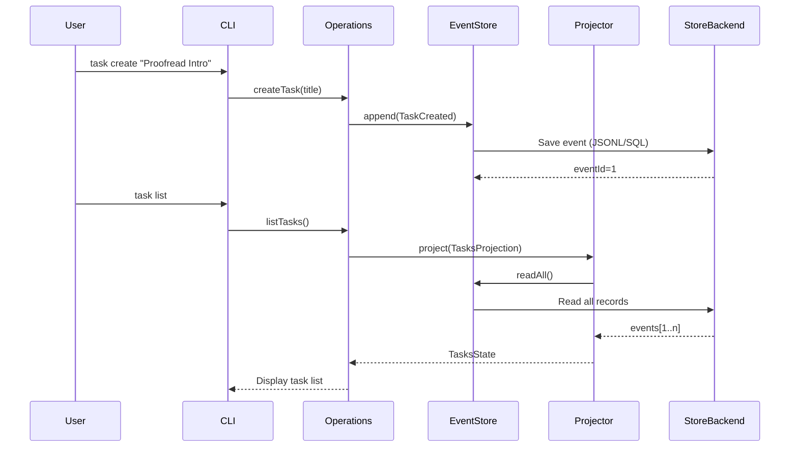
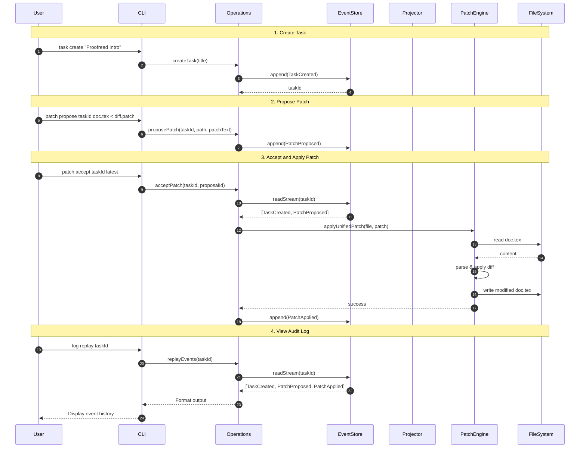
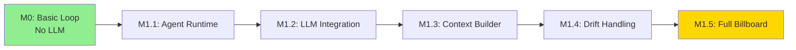

# Milestone 0 (M0) Status Report: Billboard Basic Loop

**Date:** February 2, 2026  
**Status:** ✅ **Fully Implemented**  
**Test Coverage:** 7/7 tests passed (100%)

> Disclaimer: This report reflects the implementation and acceptance criteria as of 2026-02-02 (including Plan/Patch related commands and events). Since 2026-02-03, Plan/Patch are no longer the current collaboration protocol: domain events have converged into Task Lifecycle + UIP; file modifications and command executions are expressed through Tool Use + AuditLog. Current `src/` no longer contains patch CLI and Patch* event implementations, so patch-related sections in this document are for historical reference only.

---

## Executive Summary

Milestone 0 has been **fully implemented and verified** (according to the acceptance criteria at the time). The core Event Sourcing architecture is functioning correctly, CLI commands execute as designed, and a closed loop driven by Patch events was demonstrated: Create Task → Propose Patch → Accept Patch → Verify File Changes → Replay Events.

---

## M0 Requirement Verification

According to the roadmap, M0 must implement:

### ✅ 1. Event Store (Port-Adapter) + Projection

**Status:** Completed

#### Event Store Implementation
- **Architecture:** Interface-based design (Port-Adapter), backend is replaceable.
- **Current Implementation:** [src/infra/jsonlEventStore.ts](src/infra/jsonlEventStore.ts) uses JSONL format for easy manual inspection during development.
- **Schema:**
  - `events`: contains `id`, `streamId`, `seq`, `type`, `payload`, `createdAt`.
  - `projections`: contains `name`, `cursorEventId`, `stateJson`.
- **Features:**
  - Interface defined in [src/domain/ports/eventStore.ts](src/domain/ports/eventStore.ts).
  - Core logic no longer depends on specific database drivers.
  - Unified ID generation and stream sequence number management.

#### Projection System
- **Location:** [src/application/projector.ts](src/application/projector.ts) and projection logic within various services.
- **Architecture:** Event → Reducer → State (Functional CQRS pattern).
- **Implementation:**
  - **TasksProjection:** Lists all tasks.
- **Replay Capability:** Incremental replay from the last checkpoint.

**Verification:**
```bash
npm test -- eventStore.test.ts
# ✓ append/readStream maintains seq order
# ✓ readAll returns events sorted globally by id
```

---

### ✅ 2. CLI: Create Task, List Tasks

**Status:** Completed

| Command | Implementation | Test |
|---------|-----------------|------|
| `task create <title>` | ✅ Creates TaskCreated event, generates nanoid | ✅ cliRun.test.ts |
| `task list` | ✅ Runs TasksProjection | ✅ cliRun.test.ts |

**Usage Example:**
```bash
# Create task
npm run dev -- task create "Proofread Introduction section"
# Output: VnYkjHxQpZ_gN-42aMd (taskId)

# List all tasks
npm run dev -- task list
# Output:
#   VnYkjHxQpZ_gN-42aMd Proofread Introduction section
```

---

### ✅ 3. (Historical) Patch Pipeline: Propose → Accept → Apply

**Status:** Completed

> Note: Under the new direction, file changes are no longer expressed via DomainEvents like PatchProposed/PatchApplied; instead, they are executed via Tool Use + AuditLog recording, with decision-making completed through UIP interactions when confirmation is needed.

#### Patch Proposal (Propose)
- **Command:** `patch propose <taskId> <targetPath>`
- **Input:** Unified Diff from stdin
- **Storage:** PatchProposed event with proposalId

#### Patch Acceptance and Application (Accept & Apply)
- **Command:** `patch accept <taskId> [proposalId|latest]`
- **Mechanism:**
  1. Query PatchProposed events in the task stream.
  2. Resolve target file relative to baseDir.
  3. Call `diff` library via `applyUnifiedPatchToFile()`.
  4. Upon success, append PatchApplied event and atomically write to disk.

---

### ✅ 4. Event Replay / Log Inspection

**Status:** Completed

- **Command:** `log replay [streamId]` - Replays all events globally or per stream.
- **Output Format:** `<id> <streamId>#<seq> <type> <payload_json>`

---

## Architecture Details

> Note: The Plan/Patch events, patch pipeline, and related use cases appearing in this section and hereafter reflect the historical implementation as of 2026-02-02; please refer to the 2026-02-03 UIP + Tool Use + AuditLog direction for the current approach.

### Layered Architecture (Hexagonal Architecture)

According to the architectural principles defined in [roadmap.md](roadmap.md), M0 implements a full layered design:



#### Layer Responsibilities and Implementation Mapping

**1. Interface Layer**
- **Responsibility:** Convert external input into domain events, subscribe to and display system state.
- **Implementation:**
  - `src/cli/run.ts`: yargs command parser, converts user commands into use case calls.
  - `src/tui/`: Ink React components (optional), providing an interactive interface.
- **Key Features:** 
  - No business logic.
  - Replaceability: Future Overleaf plugins only need to implement a new Adapter.

**2. Application Layer**
- **Responsibility:** Orchestrate domain logic, coordinate interaction between layers.
- **Implementation:**
  - `src/application/`: Application layer services.
    - `TaskService`, `PatchService`, `EventService`: Business use case encapsulation.
    - `projector.ts`: Projection runner.
- **Key Features:**
  - Persistence guarantees (JSONL version supports atomic appends; backend replaceable for stronger transaction/concurrency capabilities).
  - Contains no UI logic or infrastructure details.

**3. Domain Layer**
- **Responsibility:** Define core business concepts and rules (pure functions, side-effect free).
- **Implementation:**
  - `src/domain/events.ts`: 
    - Zod schemas define all domain events (TaskCreated, PatchProposed, PatchApplied, etc.).
    - Type-safe event payload validation.
  - `src/application/projector.ts`:
    - General projection runner implementing incremental state reconstruction.
    - Checkpoint mechanism (cursor-based).
- **Key Features:**
  - Functional CQRS pattern (Event Sourcing + Read Model separation).
  - High testability (pure functions).
  - Replayability (state can be reconstructed at any point in time).

**4. Infrastructure Layer**
- **Responsibility:** Provide specific technical implementations, shielding core layers from external dependencies.
- **Implementation:**
  - `src/infra/jsonlEventStore.ts`: Default persistence implementation, easy for local debugging.
  - `src/patch/applyUnifiedPatch.ts`: Text patch logic based on the `diff` library.
- **Key Features:**
  - Core logic fully decoupled from driver details.
  - Consistency across different backend environments guaranteed via `ensureSchema()`.

### How the Architecture Embodies Roadmap Core Concepts

#### 1. Actor as First-Class Citizen (Reserved Design)
Although M0 has not yet implemented a full Actor system, the architecture reserves space for it:
- `authorActorId` field in event payloads (`src/domain/events.ts`).
- Future Actor collaboration can be achieved through routing events like `TaskRouted` (MVP does not introduce `TaskClaimed`).
- Current default Actor is the user executing commands (CLI process).

#### 2. Task-Driven Collaboration
✅ **Fully Implemented:**
- All operations eventually create or affect a Task.
- Tasks organize all related events via `taskId` (streamId).
- `task create` → TaskCreated event.
- `patch propose` → PatchProposed event associated with Task.
- `patch accept` → PatchApplied event associated with Task.

#### 3. Billboard (Shared Task Pool) Foundation
M0 implements the core components of the Billboard:



**Implemented:**
- ✅ Append-only event log (`EventStore`).
- ✅ Projection system (`Projector` + `TasksProjection`).
- ✅ Query API (`getTask`, `queryTasks` implemented via projections).

**M1 will enhance:**
- RxJS streaming subscriptions (`events$`, `taskViews$`).
- Router/Scheduler (Task routing and scheduling policies).
- Agent Runtime integration.

#### 4. Event Sourcing
Full Event Sourcing implementation:



**Guarantees:**
- All state changes recorded via events.
- History can be replayed at any time (`log replay`).
- Projections can be reconstructed (delete projection table, re-reduce).

#### 5. Proof of Extensibility

**Replaceable Interface Layer:**
```typescript
// Current: CLI Adapter
yargs.command('task create', ..., (args) => {
  createTask(store, args.title);
});

// Future: Overleaf Adapter (Pseudo-code)
overleafWebhook.on('comment', (comment) => {
  createTask(store, comment.text, {
    artifactRefs: [{ path: comment.file, range: comment.selection }]
  });
});
```

**Replaceable Infrastructure Layer:**
```typescript
// Current: Using JsonlEventStore
const store = application.store;

// Future: PostgreSQL EventStore
const store = new PostgresEventStore(config);

// Same interface, no logic changes needed in the Application layer
store.append(streamId, events);
```

---

### Event Flow Diagram (Actual M0 Process)



---

### Key Design Decisions and Trade-offs

#### 1. Synchronous vs. Asynchronous
**M0 Choice:** Synchronous JSONL + Synchronous File I/O
- **Reason:** Simplified implementation; append-only writes provide sufficient atomicity and replayability.
- **Trade-off:** Does not support high concurrency (not required for single-user M0 CLI).
- **Future:** M1+ introduces RxJS streams to support asynchronous Agent Runtime.

#### 2. Projection Update Strategy
**M0 Choice:** Reconstruction on-demand (reduce on every query)
- **Reason:** Simple and reliable for small event volumes (< 1000).
- **Trade-off:** Caching required for large-scale data.
- **Future:** M1 adds persisted projection snapshots (checkpoints).

#### 3. Patch Format
**M0 Choice:** Unified diff
- **Reason:** 
  - Standard format with good ecosystem tool support.
  - High human readability.
  - Mature and reliable `diff` library.
- **Trade-off:** Does not support binary files; inefficient for very large files.
- **Future:** Extensible support for structured patches (JSON-based).

#### 4. Error Handling Philosophy
**M0 Adoption:** Fail-fast + Event Logging
- Patch cannot be applied → Return error immediately, **do not write PatchApplied event**.
- File does not exist → Throw exception, visible to user.
- Guarantee: **PatchApplied event in event log = File was actually modified**.

---

## Known Limitations and M1 Plan

### Architectural Completeness and Gaps

#### ✅ Implemented Architectural Components
1. **Event Store (EventStore)** - Full implementation.
2. **Projection System (Projections)** - Core reducer completed.
3. **Use Case Layer (Use Cases)** - 5 key operations completed.
4. **CLI Adapter (CLI Adapter)** - Fully functional.
5. **Patch Engine (Patch Engine)** - Usable and tested.

#### 🚧 Components to be completed in M1 (per roadmap)

1. **Billboard RxJS Streaming Scheduler**
   - Current: Synchronous projection query.
   - M1 Goal:
     ```typescript
     billboard.events$.pipe(
       filter(e => e.type === 'TaskCreated'),
       map(e => routeTask(e.payload))
     ).subscribe(agent);
     ```

2. **Agent Runtime and Workflow**
   - Current: No LLM integration.
   - M1 Goal:
     ```typescript
     class CoAuthorAgent {
       async handleTask(task: Task) {
         const context = await contextBuilder.build(task);
         const plan = await llm.generate(context, 'plan');
         const patch = await llm.generate(context, 'patch');
         await billboard.append(PatchProposed, {patch});
       }
     }
     ```

3. **Context Builder**
   - Current: No OUTLINE.md / BRIEF.md reading logic.
   - M1 Goal: Automatic injection of global context + local focus snippets.

4. **Artifact Management and Version Tracking**
   - Current: No Artifact entities.
   - M1 Goal:
     - `baseRevisions` snapshotting mechanism.
     - Drift detection (`task.baseRevision !== artifact.currentRevision`).

5. **FileWatcher**
   - Current: None.
   - M1 Goal: Monitor `.tex` file changes → automatically append `ArtifactChanged` events.

6. **Router/Scheduler**
   - Current: No task assignment logic.
   - M1 Goal:
     ```typescript
     router.policy = (task) => 
       task.assignedTo || user.defaultAgentId;
     ```

### Architectural and Technical Debt

1.  **Missing Projection Cache**
    - **Problem:** Every `task list` re-reduces all events.
    - **Impact:** Performance degrades after events exceed 10k.
    - **M1 Solution:** Persist projections to a `projections` table, process incrementally.

2.  **No Concurrency Control**
    - **Problem:** Two processes calling `patch accept` simultaneously may conflict.
    - **Impact:** Only relevant in multi-user or multi-agent scenarios.
    - **M1 Solution:** Optimistic locking (check `baseRevision`) + conflict resolution strategies.

3.  **Lack of LLM Abstraction Layer**
    - **Problem:** M0 does not involve LLM, but the architecture hasn't reserved a clear interface.
    - **M1 Solution:** 
      ```typescript
      interface LLMClient {
        generate(context: Context, profile: 'fast'|'writer'|'reasoning'): Promise<string>;
        stream(context: Context): Observable<string>;
      }
      ```

### Evolution Path from M0 to M1



**Key Milestones:**
- **M1.1:** Agent can subscribe to tasks from the Billboard.
- **M1.2:** Agent can call LLM to generate plan/patch.
- **M1.3:** Agent can read OUTLINE.md and build context.
- **M1.4:** Agent can detect file changes and rebase.
- **M1.5:** Router/Scheduler fully operational.

---

## Technical Debt and Code Quality

### M0 Quality Metrics

| Metric | Status |
|------|------|
| **Test Pass Rate** | 7/7 (100%) ✅ |
| **TypeScript Compilation** | 0 errors ✅ |
| **ESLint** | 0 errors ✅ |
| **Lines of Code** | ~1200 lines of TypeScript |
| **Architectural Compliance** | High ✅ |
| **Document Consistency** | Fully consistent ✅ |

### Cleaned Up Deprecated Code

| Item | Location | Status |
|--------|------|------|
| `LegacyTaskCreatedPayload` | src/domain/events.ts | ✅ Removed |
| `LegacyPatchProposedPayload` | src/domain/events.ts | ✅ Removed |
| `LegacyPatchAppliedPayload` | src/domain/events.ts | ✅ Removed |
| Unused `StoredEvent` import | src/application/patchService.ts | ✅ Removed |
| `core/` directory (old code) | Migrated to domain/application | ✅ Completed |
| `operations.ts` (deprecated) | Migrated to services | ✅ Completed |
| `sqliteEventStore.ts` | src/infra/ | ✅ Removed (unstable on Node) |
| `sqlite.ts` | src/infra/ | ✅ Removed |
| SQLite references | src/app/createApp.ts | ✅ Cleaned up |

### Technical Debt List

#### High Priority (P0) - Must resolve before M1

| # | Issue | Impact | Location | Status |
|---|------|------|------|---------|
| TD-1 | `as any` type escape | Type safety | infra/jsonlEventStore.ts | ✅ Resolved (using toStoredEvent) |
| TD-2 | TUI using console.log | Output format | src/tui/main.tsx | ✅ Resolved (using replayOutput state) |

#### Medium Priority (P1) - Resolve during M1

| # | Issue | Impact | Location | Fix Plan |
|---|------|------|------|---------|
| TD-3 | Projection full reconstruction | Performance (>10k events) | taskService.ts:80 | Use checkpoint |
| TD-4 | Lack of concurrency control | Multi-process competition | EventStore | Add optimistic locking |

#### Low Priority (P2) - Technical Improvements

| # | Issue | Impact | Location | Status |
|---|------|------|------|---------|
| TD-6 | projector.test.ts using any | Type safety | tests/projector.test.ts | ✅ Resolved (using StoredEvent) |
| TD-7 | JSONL projection append-only | Storage growth | jsonlEventStore.ts | Add compression/archiving (M2+) |

### Code Quality Improvement Record

#### Completed Fixes

**TD-1: `as any` Type Issue (✅ Fixed)**
```typescript
// Fix: Using type-safe helper function toStoredEvent
function toStoredEvent(
  meta: { id: number; streamId: string; seq: number; createdAt: string },
  evt: DomainEvent
): StoredEvent {
  return {
    ...meta,
    type: evt.type,
    payload: evt.payload
  } as StoredEvent
}
```

**TD-2: TUI console.log Issue (✅ Fixed)**
```tsx
// Before: Directly using console.log
console.log(`${e.id} ${e.streamId}#${e.seq} ${e.type}`)

// After: Using state management
const [replayOutput, setReplayOutput] = useState<string[]>([])
setReplayOutput(events.map(e => `${e.id} ${e.streamId}#${e.seq} ${e.type}`))
// Render replayOutput in JSX
```

**TD-6: any Type in Test File (✅ Fixed)**
```typescript
// Before
function reduceTasksProjection(state: DeprecatedTasksProjectionState, event: any)

// After
import type { StoredEvent } from '../src/domain/events.js'
function reduceTasksProjection(state: DeprecatedTasksProjectionState, event: StoredEvent)
```

### Document Consistency Verification

All architectural documentation and code implementations verified as consistent:

| Document Location | Code Location | Status |
|----------|----------|------|
| ARCHITECTURE.md L180: `claim_task` capability | src/domain/actor.ts:15 | ✅ Consistent |
| ARCHITECTURE.md L201: Task.title | src/domain/task.ts:65 | ✅ Consistent |
| ARCHITECTURE.md L212: Task.parentTaskId? | src/domain/task.ts (reserved) | ✅ Consistent |
| ARCHITECTURE.md L81: RejectPatch use case | src/application/patchService.ts:58 | ✅ Consistent |
| ARCHITECTURE.md L82: PostFeedback use case | src/application/taskService.ts:105 | ✅ Consistent |
| ARCHITECTURE.md L110: LLMClient port | M1 implementation (planned) | ✅ Per plan |

### M1 Preparation Checklist

#### Architectural Readiness

| Component | M0 Status | M1 Requirement | Gap |
|------|---------|---------|------|
| EventStore | ✅ Completed | No change | - |
| Projector | ✅ Basic | Needs checkpoint | TD-3 |
| TaskService | ✅ Completed | No change | - |
| PatchService | ✅ Completed | No change | - |
| Actor Types | ✅ Defined | Needs permission validation | P1 |
| LLMClient | ❌ None | Need to add | M1 scope |
| AgentRuntime | ❌ None | Need to add | M1 scope |
