# 里程碑 0 (M0) 状态报告：Billboard 基础闭环

**日期：** 2026年2月2日  
**状态：** ✅ **完全实现**  
**测试覆盖率：** 7/7 测试通过 (100%)

---

## 执行摘要

里程碑 0 已**完全实现并验证**。核心事件溯源架构运行正常，所有 CLI 命令按设计执行，补丁应用管道稳定，系统成功演示了完整的反馈闭环：创建任务 → 提出补丁 → 接受补丁 → 验证文件更改 → 回放事件。

---

## M0 需求验证

根据路线图，M0 必须实现：

### ✅ 1. 事件存储 (Port-Adapter) + 投影

**状态：** 完成

#### 事件存储实现
- **架构：** 接口化设计（Port-Adapter），后端可替换。
- **当前实现：** [src/infra/jsonlEventStore.ts](src/infra/jsonlEventStore.ts) 使用 JSONL 格式，便于开发过程中的人工查阅。
- **模式：**
  - `events`：包含 `id`, `streamId`, `seq`, `type`, `payload`, `createdAt`。
  - `projections`：包含 `name`, `cursorEventId`, `stateJson`。
- **特性：**
  - 接口定义在 [src/domain/ports/eventStore.ts](src/domain/ports/eventStore.ts)。
  - 核心逻辑不再依赖具体的数据库驱动。
  - 统一的 ID 生成与流序列号管理。

#### 投影系统
- **位置：** [src/application/projector.ts](src/application/projector.ts) 和各服务中的投影逻辑
- **架构：** 事件 → Reducer → 状态 (函数式 CQRS 模式)
- **实现：**
  - **TasksProjection：** 列出所有任务
- **回放能力：** 从最后检查点位置增量回放

**验证：**
```bash
npm test -- eventStore.test.ts
# ✓ append/readStream 保持 seq 顺序
# ✓ readAll 返回按 id 全局排序的事件
```

---

### ✅ 2. CLI：创建任务、列表任务

**状态：** 完成

| 命令 | 实现 | 测试 |
|---------|-----------------|------|
| `task create <title>` | ✅ 创建 TaskCreated 事件，生成 nanoid | ✅ cliRun.test.ts |
| `task list` | ✅ 运行 TasksProjection | ✅ cliRun.test.ts |

**使用示例：**
```bash
# 创建任务
npm run dev -- task create "校对导论部分"
# 输出: VnYkjHxQpZ_gN-42aMd (taskId)

# 列出所有任务
npm run dev -- task list
# 输出:
#   VnYkjHxQpZ_gN-42aMd 校对导论部分
```

---

### ✅ 3. 补丁管道：提出 → 接受 → 应用

**状态：** 完成

#### 补丁提出 (Propose)
- **命令：** `patch propose <taskId> <targetPath>`
- **输入：** 来自 stdin 的统一 Diff (Unified Diff)
- **存储：** 带有 proposalId 的 PatchProposed 事件

#### 补丁接受与应用 (Accept & Apply)
- **命令：** `patch accept <taskId> [proposalId|latest]`
- **机制：**
  1. 查询任务流中的 PatchProposed 事件
  2. 解决相对于 baseDir 的目标文件
  3. 使用 `applyUnifiedPatchToFile()` 调用 `diff` 库
  4. 成功后追加 PatchApplied 事件并原子写入磁盘

---

### ✅ 4. 事件回放 / 日志检查

**状态：** 完成

- **命令：** `log replay [streamId]` - 全局或按流回放所有事件
- **输出格式：** `<id> <streamId>#<seq> <type> <payload_json>`

---

## 架构详情

### 分层架构 (六边形架构)

根据 [roadmap.md](roadmap.md) 中定义的架构原则，M0 实现了完整的分层设计：


#### 各层职责与实现映射

**1. 接口层 (Interfaces)**
- **职责：** 将外部输入转换为领域事件，订阅并展示系统状态
- **实现：**
  - `src/cli/run.ts`: yargs 命令解析器，将用户命令转换为用例调用
  - `src/tui/`: Ink React 组件（可选），提供交互式界面
- **关键特性：** 
  - 无业务逻辑
  - 可替换性：未来 Overleaf 插件只需实现新的 Adapter

**2. 应用层 (Application)**
- **职责：** 编排领域逻辑，协调各层交互
- **实现：**
  - `src/application/`: 应用层服务
    - `TaskService`, `PatchService`, `EventService`: 业务用例封装
    - `projector.ts`: 投影运行器
- **关键特性：**
  - 持久化保证（JSONL 版支持原子追加；后端可替换以获得更强事务/并发能力）
  - 不包含 UI 逻辑或基础设施细节

**3. 领域层 (Domain)**
- **职责：** 定义核心业务概念和规则（纯函数、无副作用）
- **实现：**
  - `src/domain/events.ts`: 
    - Zod 模式定义所有领域事件（TaskCreated, PatchProposed, PatchApplied 等）
    - 类型安全的事件 payload 验证
  - `src/application/projector.ts`:
    - 通用投影运行器，实现增量状态重建
    - 检查点机制（cursor-based）
- **关键特性：**
  - 函数式 CQRS 模式（事件溯源 + 读模型分离）
  - 可测试性高（纯函数）
  - 可回放性（任何时刻状态可重建）

**4. 基础设施层 (Infrastructure)**
- **职责：** 提供具体的技术实现，对核心层屏蔽外部依赖。
- **实现：**
  - `src/infra/jsonlEventStore.ts`: 默认的持久化实现，易于本地调试。
  - `src/patch/applyUnifiedPatch.ts`: 基于 `diff` 库的文本补丁逻辑。
- **关键特性：**
  - 核心逻辑完全解耦驱动细节。
  - 通过 `ensureSchema()` 保证不同后端环境的一致性。

### 架构如何体现 roadmap 核心理念

#### 1. Actor 一等公民（预留设计）
虽然 M0 尚未实现完整的 Actor 系统，但架构已为此预留：
- 事件 payload 中的 `authorActorId` 字段（`src/domain/events.ts`）
- 未来可通过 `TaskRouted` 和 `TaskClaimed` 事件实现 Actor 协作
- 当前默认 Actor 为执行命令的用户（CLI 进程）

#### 2. Task 驱动协作
✅ **完全实现：**
- 所有操作最终都创建或影响 Task
- Task 通过 `taskId` (streamId) 组织所有相关事件
- `task create` → TaskCreated 事件
- `patch propose` → PatchProposed 事件关联到 Task
- `patch accept` → PatchApplied 事件关联到 Task

#### 3. Billboard（共享任务池）基础
M0 实现了 Billboard 的核心组件：

```mermaid
graph LR
    A[命令输入] --> B[EventStore.append]
    B --> C[JSONL 事件日志]
    C --> D[Projector]
    D --> E[TasksProjection]
    D --> E[TasksProjection]
    E --> G[CLI 输出]
```



**已实现：**
- ✅ 追加式事件日志（`EventStore`）
- ✅ 投影系统（`Projector` + `TasksProjection`）
- ✅ 查询 API（`getTask`, `queryTasks` 通过投影实现）

**M1 将增强：**
- RxJS 流式订阅（`events$`, `taskViews$`）
- Router/Scheduler（任务路由与调度策略）
- Agent 运行时集成

#### 4. Event Sourcing（事件溯源）
完整的事件溯源实现：

```mermaid
sequenceDiagram
    participant User
    participant CLI
    participant Operations
    participant EventStore
    participant Projector
    participant StoreBackend

    User->>CLI: task create "校对导论"
    CLI->>Operations: createTask(title)
    Operations->>EventStore: append(TaskCreated)
    EventStore->>StoreBackend: 保存事件 (JSONL/SQL)
    StoreBackend-->>EventStore: eventId=1
    
    User->>CLI: task list
    CLI->>Operations: listTasks()
    Operations->>Projector: project(TasksProjection)
    Projector->>EventStore: readAll()
    EventStore->>StoreBackend: 读取所有记录
    StoreBackend-->>Projector: events[1..n]
    Projector-->>Operations: TasksState
    Operations-->>CLI: 显示任务列表
```



**保证：**
- 所有状态变更通过事件记录
- 任何时刻可回放历史（`log replay`）
- 投影可重建（删除 projection 表，重新 reduce）

#### 5. 可扩展性证明

**接口层可替换：**
```typescript
// 当前: CLI Adapter
yargs.command('task create', ..., (args) => {
  createTask(store, args.title);
});

// 未来: Overleaf Adapter (伪代码)
overleafWebhook.on('comment', (comment) => {
  createTask(store, comment.text, {
    artifactRefs: [{ path: comment.file, range: comment.selection }]
  });
});
```

**基础设施层可替换：**
```typescript
// 当前: 使用 JsonlEventStore
const store = application.store;

// 未来: PostgreSQL EventStore
const store = new PostgresEventStore(config);

// 接口相同，应用层无需逻辑改动
store.append(streamId, events);
```

### 事件流转图（M0 实际流程）

```mermaid
sequenceDiagram
    autonumber
    participant User
    participant CLI
    participant Operations
    participant EventStore
    participant Projector
    participant PatchEngine
    participant FileSystem

    Note over User,FileSystem: 1. 创建任务
    User->>CLI: task create "校对导论"
    CLI->>Operations: createTask(title)
    Operations->>EventStore: append(TaskCreated)
    EventStore-->>Operations: taskId

    Note over User,FileSystem: 2. 提出补丁
    User->>CLI: patch propose taskId doc.tex < diff.patch
    CLI->>Operations: proposePatch(taskId, path, patchText)
    Operations->>EventStore: append(PatchProposed)
    
    Note over User,FileSystem: 3. 接受并应用补丁
    User->>CLI: patch accept taskId latest
    CLI->>Operations: acceptPatch(taskId, proposalId)
    Operations->>EventStore: readStream(taskId)
    EventStore-->>Operations: [TaskCreated, PatchProposed]
    Operations->>PatchEngine: applyUnifiedPatch(file, patch)
    PatchEngine->>FileSystem: read doc.tex
    FileSystem-->>PatchEngine: content
    PatchEngine->>PatchEngine: parse & apply diff
    PatchEngine->>FileSystem: write modified doc.tex
    PatchEngine-->>Operations: success
    Operations->>EventStore: append(PatchApplied)
    
    Note over User,FileSystem: 4. 查看审计日志
    User->>CLI: log replay taskId
    CLI->>Operations: replayEvents(taskId)
    Operations->>EventStore: readStream(taskId)
    EventStore-->>Operations: [TaskCreated, PatchProposed, PatchApplied]
    Operations-->>CLI: 格式化输出
    CLI-->>User: 显示事件历史
```



### 关键设计决策与权衡

#### 1. 同步 vs 异步
**M0 选择：** 同步 JSONL + 同步文件 I/O
- **理由：** 简化实现；追加写入具备足够的原子性与可回放性
- **权衡：** 不支持高并发（M0 单用户 CLI 无需考虑）
- **未来：** M1+ 引入 RxJS 流支持异步 Agent 运行时

#### 2. 投影更新策略
**M0 选择：** 按需重建（每次查询时 reduce）
- **理由：** 简单可靠，事件量小（< 1000）
- **权衡：** 大规模数据需要缓存
- **未来：** M1 增加持久化投影快照（checkpoint）

#### 3. Patch 格式
**M0 选择：** 统一 diff (unified diff)
- **理由：** 
  - 标准格式，生态工具支持好
  - 人类可读性强
  - `diff` 库成熟可靠
- **权衡：** 不支持二进制文件、大文件效率低
- **未来：** 可扩展支持结构化 patch（JSON-based）

#### 4. 错误处理哲学
**M0 采用：** Fail-fast + 事件记录
- 补丁无法应用 → 立即返回错误，**不写入 PatchApplied 事件**
- 文件不存在 → 抛出异常，用户可见
- 保证：**事件日志中的 PatchApplied 事件 = 文件确实被修改**

---

## 已知局限性与 M1 计划

### 当前架构的完整性与缺失

#### ✅ 已实现的架构组件
1. **事件存储 (EventStore)** - 完整实现
2. **投影系统 (Projections)** - 核心 reducer 完成
3. **用例层 (Use Cases)** - 5 个关键操作完成
4. **CLI 适配器 (CLI Adapter)** - 功能齐全
5. **补丁引擎 (Patch Engine)** - 可用且经过测试

#### 🚧 M1 需要补全的组件（按 roadmap）

1. **Billboard RxJS 流式调度**
   - 当前：同步查询投影
   - M1 目标：
     ```typescript
     billboard.events$.pipe(
       filter(e => e.type === 'TaskCreated'),
       map(e => routeTask(e.payload))
     ).subscribe(agent);
     ```

2. **Agent Runtime 与 Workflow**
   - 当前：无 LLM 集成
   - M1 目标：
     ```typescript
     class CoAuthorAgent {
       async handleTask(task: Task) {
         const context = await contextBuilder.build(task);
         const plan = await llm.generate(context, 'plan');
         const patch = await llm.generate(context, 'patch');
         await billboard.append(PatchProposed, {patch});
       }
     }
     ```

3. **Context Builder（上下文构建器）**
   - 当前：无 OUTLINE.md / BRIEF.md 读取逻辑
   - M1 目标：自动注入全局上下文 + 局部聚焦片段

4. **Artifact 管理与版本跟踪**
   - 当前：无 Artifact 实体
   - M1 目标：
     - `baseRevisions` 快照机制
     - Drift 检测（`task.baseRevision !== artifact.currentRevision`）

5. **FileWatcher（文件监控）**
   - 当前：无
   - M1 目标：监控 `.tex` 文件变化 → 自动追加 `ArtifactChanged` 事件

6. **Router/Scheduler（任务路由与调度）**
   - 当前：无任务分配逻辑
   - M1 目标：
     ```typescript
     router.policy = (task) => 
       task.assignedTo || user.defaultAgentId;
     ```

### 架构债务与技术债

1.  **投影缓存缺失**
    - **问题：** 每次 `task list` 都重新 reduce 全部事件
    - **影响：** 事件超过 10k 后性能下降
    - **M1 方案：** 持久化投影到 `projections` 表，只处理增量

2.  **无并发控制**
    - **问题：** 两个进程同时 `patch accept` 可能冲突
    - **影响：** 仅在多用户或多 Agent 场景
    - **M1 方案：** 乐观锁（检查 `baseRevision`）+ 冲突解决策略

3.  **缺少 LLM 抽象层**
    - **问题：** M0 不涉及 LLM，但架构未预留清晰接口
    - **M1 方案：** 
      ```typescript
      interface LLMClient {
        generate(context: Context, profile: 'fast'|'writer'|'reasoning'): Promise<string>;
        stream(context: Context): Observable<string>;
      }
      ```

### 从 M0 到 M1 的演进路径

```mermaid
graph LR
    M0[M0: 基础闭环<br/>无 LLM] --> M1A[M1.1: Agent Runtime]
    M1A --> M1B[M1.2: LLM 集成]
    M1B --> M1C[M1.3: Context Builder]
    M1C --> M1D[M1.4: Drift 处理]
    M1D --> M1E[M1.5: 完整 Billboard]
    
    style M0 fill:#90EE90
    style M1E fill:#FFD700
```



**关键里程碑：**
- **M1.1:** Agent 能从 Billboard 订阅任务
- **M1.2:** Agent 能调用 LLM 生成 plan/patch
- **M1.3:** Agent 能读取 OUTLINE.md 并构建上下文
- **M1.4:** Agent 能检测文件变化并 rebase
- **M1.5:** Router/Scheduler 完整运行

---

## 技术债务与代码质量

### M0 质量指标

| 指标 | 状态 |
|------|------|
| **测试通过率** | 7/7 (100%) ✅ |
| **TypeScript 编译** | 0 错误 ✅ |
| **ESLint** | 0 错误 ✅ |
| **代码行数** | ~1200 行 TypeScript |
| **架构合规性** | 高 ✅ |
| **文档一致性** | 完全一致 ✅ |

### 已清理的废弃代码

| 清理项 | 位置 | 状态 |
|--------|------|------|
| `LegacyTaskCreatedPayload` | src/domain/events.ts | ✅ 已移除 |
| `LegacyPatchProposedPayload` | src/domain/events.ts | ✅ 已移除 |
| `LegacyPatchAppliedPayload` | src/domain/events.ts | ✅ 已移除 |
| 未使用的 `StoredEvent` import | src/application/patchService.ts | ✅ 已移除 |
| `core/` 目录 (旧代码) | 已迁移到 domain/application | ✅ 已完成 |
| `operations.ts` (deprecated) | 已迁移到 services | ✅ 已完成 |
| `sqliteEventStore.ts` | src/infra/ | ✅ 已移除 (Node 不稳定) |
| `sqlite.ts` | src/infra/ | ✅ 已移除 |
| SQLite 相关引用 | src/app/createApp.ts | ✅ 已清理 |

### 技术债务清单

#### 高优先级 (P0) - M1 前必须解决

| # | 问题 | 影响 | 位置 | 状态 |
|---|------|------|------|---------|
| TD-1 | `as any` 类型逃逸 | 类型安全 | infra/jsonlEventStore.ts | ✅ 已解决 (使用 toStoredEvent) |
| TD-2 | TUI 使用 console.log | 输出格式 | src/tui/main.tsx | ✅ 已解决 (使用 replayOutput 状态) |

#### 中优先级 (P1) - M1 期间解决

| # | 问题 | 影响 | 位置 | 修复方案 |
|---|------|------|------|---------|
| TD-3 | 投影每次全量重建 | 性能（>10k事件时） | taskService.ts:80 | 使用 checkpoint |
| TD-4 | 缺少并发控制 | 多进程竞争 | EventStore | 添加乐观锁 |

#### 低优先级 (P2) - 技术改进

| # | 问题 | 影响 | 位置 | 状态 |
|---|------|------|------|---------|
| TD-6 | projector.test.ts 使用 any | 类型安全 | tests/projector.test.ts | ✅ 已解决 (使用 StoredEvent) |
| TD-7 | JSONL 投影追加式存储 | 存储增长 | jsonlEventStore.ts | 添加压缩/归档 (M2+) |

### 代码质量改进记录

#### 已完成的修复

**TD-1: `as any` 类型问题（✅ 已修复）**
```typescript
// 修复方案：使用类型安全的辅助函数 toStoredEvent
function toStoredEvent(
  meta: { id: number; streamId: string; seq: number; createdAt: string },
  evt: DomainEvent
): StoredEvent {
  return {
    ...meta,
    type: evt.type,
    payload: evt.payload
  } as StoredEvent
}
```

**TD-2: TUI console.log 问题（✅ 已修复）**
```tsx
// 修复前：直接使用 console.log
console.log(`${e.id} ${e.streamId}#${e.seq} ${e.type}`)

// 修复后：使用状态管理
const [replayOutput, setReplayOutput] = useState<string[]>([])
setReplayOutput(events.map(e => `${e.id} ${e.streamId}#${e.seq} ${e.type}`))
// 在 JSX 中渲染 replayOutput
```

**TD-6: 测试文件 any 类型（✅ 已修复）**
```typescript
// 修复前
function reduceTasksProjection(state: DeprecatedTasksProjectionState, event: any)

// 修复后
import type { StoredEvent } from '../src/domain/events.js'
function reduceTasksProjection(state: DeprecatedTasksProjectionState, event: StoredEvent)
```

### 文档一致性验证

所有架构文档与代码实现已验证一致：

| 文档位置 | 代码位置 | 状态 |
|----------|----------|------|
| ARCHITECTURE.md L180: `claim_task` capability | src/domain/actor.ts:15 | ✅ 一致 |
| ARCHITECTURE.md L201: Task.title | src/domain/task.ts:65 | ✅ 一致 |
| ARCHITECTURE.md L212: Task.parentTaskId? | src/domain/task.ts (预留) | ✅ 一致 |
| ARCHITECTURE.md L81: RejectPatch 用例 | src/application/patchService.ts:58 | ✅ 一致 |
| ARCHITECTURE.md L82: PostFeedback 用例 | src/application/taskService.ts:105 | ✅ 一致 |
| ARCHITECTURE.md L110: LLMClient 端口 | M1 实现（已规划） | ✅ 符合计划 |

### M1 准备清单

#### 架构就绪度

| 组件 | M0 状态 | M1 需求 | 差距 |
|------|---------|---------|------|
| EventStore | ✅ 完成 | 无变化 | - |
| Projector | ✅ 基础 | 需 checkpoint | TD-3 |
| TaskService | ✅ 完成 | 无变化 | - |
| PatchService | ✅ 完成 | 无变化 | - |
| Actor 类型 | ✅ 定义 | 需权限校验 | P1 |
| LLMClient | ❌ 无 | 需添加 | M1 范围 |
| AgentRuntime | ❌ 无 | 需添加 | M1 范围 |
| ContextBuilder | ❌ 无 | 需添加 | M1 范围 |
| FileWatcher | ❌ 无 | 需添加 | M1 范围 |

> **说明**：LLMClient、AgentRuntime、ContextBuilder、FileWatcher 是 M1 的实现范围，不属于 M0 技术债务。M0 已按计划完成核心事件溯源架构。

#### 推荐的 M1 实施顺序

```
M1.1: 添加 LLMClient 接口 (src/domain/ports/llmClient.ts)
      ├─ 定义 generate(), stream() 方法
      └─ 添加 Claude/OpenAI 适配器

M1.2: 实现 AgentRuntime (src/agents/runtime.ts)
      ├─ 订阅 Billboard 任务
      ├─ 调用 LLMClient 生成 Plan/Patch
      └─ 发射事件

M1.3: 实现 ContextBuilder (src/application/contextBuilder.ts)
      ├─ 读取 OUTLINE.md, BRIEF.md, STYLE.md
      ├─ 读取目标文件片段
      └─ 组装 prompt

M1.4: 添加 Drift 检测
      ├─ baseRevision 比对
      ├─ FileWatcher 集成
      └─ TaskNeedsRebase 事件

M1.5: 投影优化
      ├─ 持久化 checkpoint (解决 TD-3)
      └─ 增量更新
```

### 实施检查清单

#### Phase 1: M0 清理（✅ 已完成）

- [x] 移除 deprecated legacy types
- [x] 移除未使用的 imports
- [x] 移除 SQLite EventStore 实现
- [x] 验证所有测试通过
- [x] 验证文档与代码一致性

#### Phase 2: 代码质量（✅ 已完成）

- [x] 修复 TUI console.log 问题 (TD-2)
- [x] 修复 `as any` 类型问题 (TD-1)
- [x] 修复测试文件 any 类型 (TD-6)
- [x] 修复 ESLint prefer-const 错误

#### Phase 3: M1 准备（部分完成）

- [ ] 添加投影 checkpoint (TD-3)
- [ ] 添加并发控制 (TD-4)
- [ ] 实现 LLMClient 接口
- [ ] 实现 AgentRuntime

### 审计记录

**2026-02-02 架构审计**

**清理完成：**
- 移除 3 个 deprecated legacy types ✅
- 移除 SQLite EventStore 实现 ✅
- 修复 2 个 ESLint 错误（prefer-const）✅

**技术债务解决：**
- TD-1: `as any` 类型逃逸 → 使用 toStoredEvent 辅助函数 ✅
- TD-2: TUI console.log → 使用 replayOutput 状态展示 ✅
- TD-6: 测试文件 any 类型 → 使用 StoredEvent 类型 ✅

**文档验证：**
- ARCHITECTURE.md 与代码完全一致 ✅
- 所有能力定义、字段定义、用例映射均已确认 ✅

**质量指标：**
- 测试覆盖率：7/7 (100%) ✅
- TypeScript 编译：0 错误 ✅
- ESLint：0 错误 ✅
- 架构合规性：高 ✅

**遗留工作（M1 范围）：**
- TD-3: 投影缓存（性能优化）
- TD-4: 并发控制（多 Agent 场景）
- M1 新组件：LLMClient、AgentRuntime、ContextBuilder、FileWatcher

---

## 结论

### M0 验收标准：✅ 全部达成

| 标准 | 状态 | 证据 |
|-----------|--------|----------|
| 实现事件存储与投影 | ✅ | eventStore.ts, projections.ts |
| CLI: 创建、列表、打开线程 | ✅ | CLI 命令可用，测试验证通过 |
| CLI: 补丁提出、接受、应用 | ✅ | patchApply 测试通过，E2E 流程跑通 |
| 事件日志回放 | ✅ | `log replay` 命令正常运行 |
| 架构符合六边形模式 | ✅ | 清晰的层次分离，接口可替换 |

### 架构质量评估

**优点：**
- ✅ 严格的层次隔离（Domain/Application/Infrastructure/Interface）
- ✅ 事件溯源保证审计能力与可回放性
- ✅ 投影模式实现 CQRS 读写分离
- ✅ 端口-适配器模式保证未来扩展性（Overleaf/TODO/多 Agent）
- ✅ 类型安全（Zod schema 验证所有事件）

**待改进：**
- ⚠️ 缺少异步流式编程支持（M1 引入 RxJS）
- ⚠️ 投影未持久化（M1 增加 checkpoint）
- ⚠️ 无资源隔离与权限控制（M1+ 增加 Actor 系统）

### 从 M0 到 roadmap 完整愿景的路径

M0 的基础对于实现 roadmap 中的完整愿景至关重要：

1. **Task 驱动协作** - ✅ 基础已建立，M1 增加 Agent Runtime
2. **Billboard 共享池** - 🚧 EventStore 已完成，M1 增加流式调度
3. **Actor 一等公民** - 🚧 预留设计，M1 增加 Router/Scheduler
4. **可扩展到 Overleaf** - ✅ Adapter 模式已验证，直接复用 Billboard

**关键成功因素：** M0 没有走捷径，严格遵循了 roadmap 的架构原则，为后续迭代打下了坚实基础。

---

## 附录：架构决策记录 (ADR)

### ADR-001: 选择 JSONL 作为事件存储（当前实现）
- **决策：** 使用 JSONL 作为追加式事件日志与投影 checkpoint 存储（`.coauthor/events.jsonl` / `.coauthor/projections.jsonl`）。
- **理由：** 
  - 零配置部署，便于调试与回放
  - 满足 M0 单用户事件溯源的可靠性需求
  - 避免依赖 Node.js 原生 `node:sqlite` 的实验性特性带来的兼容风险
- **权衡：** 不提供数据库级事务与并发隔离；如需更强一致性与多进程并发，后续可在 EventStore 端口下替换为稳定数据库后端

### ADR-002: 事件即审计日志，不做软删除
- **决策：** 事件永不删除，只追加
- **理由：** 
  - 完整审计链路
  - 可回放任意时刻状态
  - 符合事件溯源最佳实践
- **权衡：** 存储增长，但可通过归档解决（M2+）

### ADR-003: 投影按需重建而非增量更新（M0）
- **决策：** 每次查询时从头 reduce
- **理由：** 
  - 实现简单
  - 易于调试
  - M0 事件量小（< 1000）
- **权衡：** 性能不足以支持生产，M1 改为持久化投影

### ADR-004: Patch 采用 unified diff 格式
- **决策：** 使用标准 unified diff
- **理由：** 
  - 人类可读
  - 生态工具成熟（git、diff 命令）
  - `diff` 库可靠
- **权衡：** 不适合二进制，但 M0 只处理文本

### ADR-005: CLI 先行，TUI 可选
- **决策：** M0 优先实现 CLI，TUI 作为增强
- **理由：** 
  - CLI 可脚本化
  - 易于测试
  - 满足核心开发者需求
- **权衡：** 用户体验不如 GUI，但符合 V0 定位

---

## M1 任务规划

### M1 目标：LLM 集成基础

基于 M0 已完成的架构，M1 的核心任务是**添加 LLM 抽象层和基础 Agent 运行时**，为 M2 端到端 Workflow 做准备。

### M1 与 M0 的关系

**M0 超预期完成项（原计划在 M1）：**
- ✅ Domain 层完整（Actor, Task, Artifact, Events 含 authorActorId）
- ✅ Application 层完整（TaskService, PatchService, EventService）
- ✅ 六边形架构（Port-Adapter）

**M1 实际需要做的工作：**
- ❌ LLMClient 端口与适配器（核心）
- ❌ AgentRuntime 基础框架
- ❌ ContextBuilder 服务
- ⚠️ 投影 Checkpoint 优化（解决 TD-3）

### M1 详细任务分解

#### 任务 1：定义 LLMClient 端口（1-2h）

**目标：** 创建 LLM 抽象层，支持多模型切换

**产出：**
```typescript
// src/domain/ports/llmClient.ts
export type LLMProfile = 'fast' | 'writer' | 'reasoning'

export interface LLMClient {
  generate(context: string, profile: LLMProfile): Promise<string>
  stream(context: string, profile: LLMProfile): Observable<string>
}
```

**设计决策：**
- 使用 profile 而非直接模型名，便于切换底层模型
- 支持同步（generate）和流式（stream）两种模式
- context 是纯文本，由 ContextBuilder 负责构建

#### 任务 2：实现 Anthropic 适配器（2-3h）

**目标：** 实现 Claude API 集成

**产出：**
```typescript
// src/infra/anthropicLLMClient.ts
export class AnthropicLLMClient implements LLMClient {
  private modelMap = {
    fast: 'claude-3-5-haiku-20241022',
    writer: 'claude-3-5-sonnet-20241022',
    reasoning: 'claude-3-7-sonnet-20250219'
  }
  
  async generate(context: string, profile: LLMProfile): Promise<string>
  // stream() 可选实现
}
```

**技术选择：**
- 使用官方 `@anthropic-ai/sdk`
- 初期只实现 generate()，stream() 留给 M2
- API Key 通过环境变量 `ANTHROPIC_API_KEY` 传入

#### 任务 3：实现 ContextBuilder（2-3h）

**目标：** 构建任务上下文字符串，供 LLM 使用

**产出：**
```typescript
// src/application/contextBuilder.ts
export class ContextBuilder {
  buildTaskContext(task: TaskView): string {
    // 1. 任务描述
    // 2. 相关文件片段（基于 artifactRefs）
    // 3. TODO: OUTLINE.md 注入（M4）
  }
  
  private readArtifact(ref: ArtifactRef): string
}
```

**实现要点：**
- 读取 `task.artifactRefs` 指定的文件
- M1 暂不支持 range 裁剪（读整个文件）
- M1 暂不注入 OUTLINE.md（留给 M4）

#### 任务 4：实现基础 AgentRuntime（3-4h）

**目标：** Agent 生命周期管理 + 手动任务处理

**产出：**
```typescript
// src/agents/runtime.ts
export class AgentRuntime {
  start(): void  // 启动 Agent（M1 仅打印日志）
  stop(): void   // 停止 Agent
  
  // 手动处理任务（M1 测试用）
  async handleTask(task: TaskView): Promise<void> {
    // 1. 调用 ContextBuilder
    // 2. 调用 LLMClient.generate()
    // 3. 打印结果（不写事件）
  }
}
```

**M1 限制：**
- 不实现自动任务订阅（M2 增加）
- 不写 `AgentPlanPosted` 事件（M2 增加）
- 只验证 LLM 调用链路通畅

#### 任务 5：投影 Checkpoint 优化（2-3h）

**目标：** 解决 TD-3，提升投影性能

**改动：**
```typescript
// 修改 src/application/projector.ts
export async function projectWithCheckpoint<S>(
  store: EventStore,
  projectionName: string,
  initialState: S,
  reducer: (state: S, event: StoredEvent) => S
): Promise<S> {
  // 1. 从 .coauthor/projections.jsonl 读取 checkpoint
  // 2. 只处理 checkpoint 之后的新事件
  // 3. 保存新 checkpoint
}
```

**持久化方案：**
- 复用 JsonlEventStore 的 projection 存储
- 格式：`{ name, cursorEventId, stateJson }`
- 每次投影更新后保存

#### 任务 6：新增事件类型（1h）

**新增事件：**
1. `AgentPlanPosted`：Agent 发布执行计划
2. `UserFeedbackPosted`：用户对计划/补丁的反馈

**用途：**
- M1 定义 schema，M2 开始使用
- 为完整 Workflow 做准备

#### 任务 7：测试（2-3h）

**新增测试：**
- `tests/llmClient.test.ts`：Mock LLMClient 测试
- `tests/contextBuilder.test.ts`：上下文构建测试
- `tests/agentRuntime.test.ts`：Agent 生命周期测试
- 更新 `tests/projector.test.ts`：测试 checkpoint 机制

### M1 验收标准

✅ **通过以下测试即认为 M1 完成：**

```bash
# 1. 启动 Agent（手动模式）
npm run dev -- agent start
# 输出：[Agent default-agent] Started

# 2. 创建任务
npm run dev -- task create "改进导论第一段" --file chapters/01_intro.tex
# 输出：taskId=xyz

# 3. 手动触发 Agent
npm run dev -- agent handle xyz
# 输出：
#   [Agent] Handling task xyz
#   [Agent] Generated plan:
#   1. 分析当前段落结构
#   2. 识别需要改进的点
#   3. 生成改进建议

# 4. 验证性能优化
npm run dev -- task list
# 使用 checkpoint，事件量大时性能明显提升

# 5. 所有测试通过
npm test
```

### M1 与 M2 的分界线

| 功能 | M1 状态 | M2 目标 |
|------|---------|--------|
| LLM 调用 | ✅ 可用 | 增强（流式输出） |
| Agent 任务处理 | ✅ 手动触发 | 自动订阅 |
| Plan 生成 | ✅ 打印到控制台 | 写入 `AgentPlanPosted` 事件 |
| Patch 生成 | ❌ 无 | 完整实现 |
| 用户确认流程 | ❌ 无 | `/accept` `/reject` 命令 |
| 文件更新 | ❌ 无 | 自动 apply patch |

**关键设计原则：**
- M1 验证基础设施可用性（LLM + Context + Agent 框架）
- M2 实现完整业务流程（Task → Plan → Patch → Review → Apply）

### 实施建议

1. **先做 Task 1-3**（LLMClient + ContextBuilder）
   - 这是最核心的基础设施
   - 完成后可以单独测试 LLM 调用

2. **再做 Task 4**（AgentRuntime）
   - 整合前面的组件
   - 验证端到端链路

3. **最后做 Task 5-7**（优化 + 补充）
   - Checkpoint 可以解决性能问题
   - 新增事件为 M2 做准备
   - 测试保证质量

**预估总工时：** 13-19 小时（约 2-3 个工作日）

### 风险评估

| 风险 | 影响 | 缓解措施 |
|------|------|----------|
| Anthropic API 不稳定 | M1 进度受阻 | 使用 Mock LLMClient 开发 |
| Context 构建复杂 | ContextBuilder 实现耗时 | M1 只读整个文件，不做裁剪 |
| Checkpoint 实现困难 | 性能优化失败 | 可延后到 M2，不影响核心功能 |

---

*文档版本: 2026-02-02*  
*相关文档: ARCHITECTURE.md, DOMAIN.md, MILESTONES.md*
