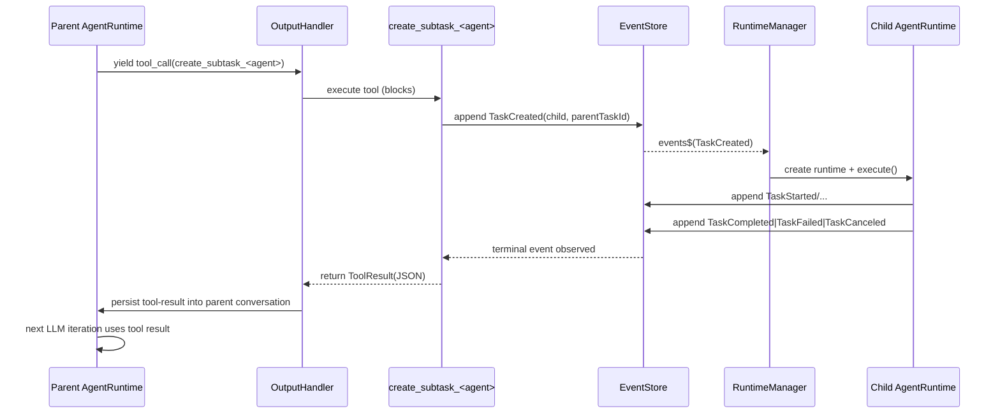

# SubAgents and SubTasks Plan

## Purpose
Add SubAgent and SubTask support where:
- One agent equals one task (task cannot change agent).
- An agent can spawn subtasks handled by other agents.
- Each subtask runs in its own `AgentRuntime` (subprocess analogy).
- `createSubAgent` blocks until the subtask reaches a terminal state (`done`/`failed`/`canceled`), even if the subtask is `awaiting_user`.

## Primary Invariants
- Task ↔ Agent binding is immutable: `TaskCreated.agentId` defines the executor for the entire lifecycle.
- Every Task has exactly one `AgentRuntime` when executed.
- Subtasks are normal Tasks with `parentTaskId` set.
- `createSubAgent` is a tool call executed inside the parent task runtime, but it coordinates a separate child runtime.

## Glossary
- Agent: stateless workflow strategy (`src/agents/agent.ts`).
- AgentRuntime: task-scoped executor that manages conversation, tool execution, UIP pause/resume, and lifecycle events (`src/agents/runtime.ts`).
- Parent task: the task whose agent calls `createSubAgent`.
- Child task (subtask): a task created by a parent with `parentTaskId` set.
- SubAgent: a registered agent implementation + a corresponding tool entry used to spawn its tasks.

## Architecture Overview
### Domain Layer
- Extend `TaskCreated` payload to include optional `parentTaskId`.
- Keep existing lifecycle events and UIP events unchanged.
- Do not add `SubtaskCreated/SubtaskCompleted` events; the subtask is represented by normal `TaskCreated/TaskCompleted/TaskFailed/TaskCanceled`.

### Application Layer
- `TaskService.createTask` must accept `parentTaskId`.
- `TaskService.createTask` must allow overriding the author actor for correct attribution (agent-created subtasks should not be attributed to `user_default`).
- Task projection (`TaskView`) must be extended to:
  - Store `parentTaskId`.
  - Maintain `childTaskIds` on the parent.
  - Store `summary` from `TaskCompleted`.
  - Store `failureReason` from `TaskFailed`.

### Agents Layer
- `RuntimeManager` remains the only subscriber to `EventStore.events$` and is responsible for creating and routing to task-scoped runtimes.
- A subtask is executed exactly like any other task: `TaskCreated` → `RuntimeManager` creates `AgentRuntime` → runtime emits `TaskStarted` → tool loop → terminal event.
- The parent runtime does not “run” the child; it blocks in a tool call waiting for child terminal events.

### Tools Layer
- SubAgent spawning is expressed as tool use ("createSubAgent as tool use").
- For each agent `A`, register a tool `create_subtask_<A.id>` whose implementation:
  - Creates a child task assigned to agent `A`.
  - Ensures the runtime system will execute/resume the child.
  - Waits until the child reaches a terminal state.
  - Returns the child’s final output or failure reason.

## End-to-End Flow
### Sequence (Normal Completion)

### Sequence (Child Enters UIP / awaiting_user)
- Child runtime emits `UserInteractionRequested` and pauses (its task status becomes `awaiting_user`).
- `createSubAgent` does not return. It keeps waiting for a child terminal event.
- The user responds to the child UIP via TUI (or a separate CLI process). `RuntimeManager` routes `UserInteractionResponded` to the child runtime and it resumes.
- Once the child reaches `done/failed/canceled`, `createSubAgent` unblocks and returns.

## UIP Semantics (Critical Requirement)
- UIP is always scoped to the task that requested it.
- Child UIP events are written to the child task stream.
- `createSubAgent` blocks through `awaiting_user`; it never returns an intermediate “AwaitingUser” result.

### Practical UI Requirement
Because the parent tool call is blocked, the user must have a way to answer child UIP while the parent is waiting.
- TUI mode satisfies this because it continuously refreshes tasks and shows pending interactions for any task in `awaiting_user`.
- In CLI one-shot execution, the user must respond from a separate process/terminal (e.g. `coauthor interact respond <childTaskId> ...`) while the original process remains running and waiting.

## Tool Contract
### Tool Name
- `create_subtask_<agentId>` (one per agent; stable naming).

### Tool Parameters
- `title` (required)
- `intent` (optional) initial prompt for the child task
- `artifactRefs` (optional)
- `priority` (optional)

### Tool Result
The tool returns only when the child is terminal.
- `taskId`
- `agentId`
- `subTaskStatus`: `Success` | `Error` | `Cancel`
- `summary` (optional)
- `failureReason` (optional)
- `finalAssistantMessage` (optional)

## Waiting Strategy (Avoid Heavy Polling)
Blocking must be implemented without repeatedly rebuilding full projections.

Preferred strategy:
- Subscribe to `EventStore.events$` inside the tool (ephemeral subscription).
- Resolve the wait promise on `TaskCompleted`/`TaskFailed`/`TaskCanceled` events for the child task.

Fallback strategy:
- If `events$` subscription is not accessible in the tool (missing injection), poll `EventStore.readStream(childTaskId)` from last seen `seq`.

## Runtime Manager Requirement (Resuming Child on UIP)
For `createSubAgent` to block through UIP and still make progress, the process must be running a `RuntimeManager` subscription so that `UserInteractionResponded` events are routed to the correct child runtime.

Plan:
- The `create_subtask_<agent>` tool must ensure `RuntimeManager.start()` has been called in-process.
- If `RuntimeManager.isRunning` is already true (TUI), do nothing.
- If false (CLI/manual execution), start it before creating the child task.

## Data Model and Projection Details
### Domain changes
- Add `parentTaskId?: string` to `TaskCreatedPayloadSchema` in `src/domain/events.ts`.

### Application changes
- Extend `CreateTaskOptions` in `src/application/taskService.ts` to include `parentTaskId?: string` and `authorActorId?: string` override.
- Update the tasks projection reducer in `src/application/taskService.ts`:
  - On `TaskCreated`, set `parentTaskId`.
  - If `parentTaskId` is present and parent exists, append to `childTaskIds` idempotently.
  - On `TaskCompleted`, store `summary`.
  - On `TaskFailed`, store `failureReason`.

## Concurrency, Pause, and Cancel (Known Conflicts)
Blocking tools introduce a real mismatch with current cooperative pause/cancel semantics:
- `AgentRuntime.onCancel()` and `onPause()` only take effect between agent yields, not while a tool call is blocked.

Required mitigation:
- `createSubAgent` waiting loop must periodically check parent task state via `TaskService.getTask(parentTaskId)` or `EventStore.readStream(parentTaskId)`.
- If the parent task is canceled, the tool should:
  - Optionally cancel the child task (policy decision), and
  - Abort waiting and return `Cancel` (or throw a tool error; prefer returning `Cancel` to keep results structured).

Optional improvement (better engineering):
- Add `AbortSignal` (or equivalent) to `ToolContext` and have `OutputHandler` abort the signal when `TaskCanceled/TaskPaused` is observed, so long-running tools can stop immediately.

## Conflicts With Current Codebase and Resolutions
- `TaskCreated` lacks `parentTaskId`.
  - Fix by extending `TaskCreatedPayloadSchema` and updating all creation call sites/tests.

- `TaskService` attributes events to a fixed `currentActorId`.
  - Fix by allowing per-call author override so agent-created subtasks are attributed to the calling agent.

- `TaskView` does not record terminal outputs.
  - Fix by adding `summary` and `failureReason` fields to projection.

- `createSubAgent` must block across `awaiting_user`.
  - Requires `RuntimeManager` running in-process to route `UserInteractionResponded` to the child runtime.
  - Fix by starting `RuntimeManager` in the tool if needed.

- Potential double execution.
  - Do not call `runtimeManager.executeTask(childTaskId)` when `RuntimeManager.isRunning` is true; rely on the event subscription.

## Code Touchpoints
- `src/domain/events.ts`
- `src/domain/task.ts`
- `src/application/taskService.ts`
- `src/agents/runtimeManager.ts`
- `src/agents/runtime.ts`
- `src/infra/tools/index.ts`
- `src/app/createApp.ts`
- `src/cli/commands/task.ts`
- `src/tui/components/TaskList.tsx`

## Testing Plan
- Projection tests:
  - `parentTaskId` stored on child.
  - `childTaskIds` updated idempotently on parent.
  - `summary` and `failureReason` stored on terminal events.

- Subagent tool tests:
  - Returns only on terminal events.
  - Blocks across `awaiting_user` (simulate UIP by emitting interaction and then responding from a separate append).
  - Returns correct `finalAssistantMessage` extraction.

- Runtime tests:
  - Child runtime is created separately and handles UIP resume.

## Implementation Steps
1. Extend `TaskCreated` payload with `parentTaskId`.
2. Extend `TaskService.createTask` with `parentTaskId` and per-call author override.
3. Update tasks projection to maintain parent/child relations and terminal outputs.
4. Implement `create_subtask_<agentId>` tool factory with injected services and event-driven waiting.
5. Wire tool registration after agent registration in `createApp`.
6. Update CLI/TUI to surface parent/child and to make child UIP discoverable while parent waits.
7. Add tests for projection, tool blocking behavior, and runtime routing.
