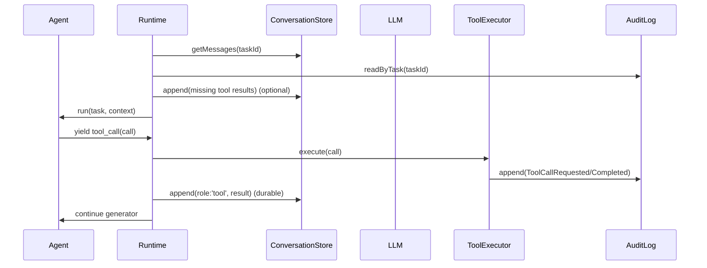

# LLM Context Persistence and Recovery

## Goals

- LLM context of tasks can be recovered and continue running after session restarts or crashes.
- Tool calls and tool results are correctly paired in history to avoid "missing tool result" errors.
- Reasoning can be optionally persisted and included in context when needed.

## Persisted Objects

- **ConversationStore**: LLM message sequence for each task (system/user/assistant/tool).
  - Schema: see [conversationStore.ts](file:///Users/yangjerry/Repo/coauthor/src/domain/ports/conversationStore.ts#L25-L44)
- **AuditLog**: Factual records of tool execution (ToolCallRequested/ToolCallCompleted).
  - Schema: see [auditLog.ts](file:///Users/yangjerry/Repo/coauthor/src/domain/ports/auditLog.ts)

## Key Semantics

- **Assistant messages** can simultaneously contain:
  - `content`: Display text.
  - `reasoning`: Optional reasoning text (for diagnosis/recovery).
  - `toolCalls`: List of tool call requests.
- **Tool messages** must contain:
  - `toolCallId`: Corresponding one-to-one with the `toolCallId` in `toolCalls`.
  - `content`: Tool output (JSON string or plain text).

## Runtime Recovery (Repair)

When starting or resuming a task, the Runtime will:

1. Read historical messages from the `ConversationStore`.
2. Scan `assistant.toolCalls` in the history.
3. For any `toolCallId` missing a corresponding `tool` message:
   - If `ToolCallCompleted` exists in the `AuditLog`: Backfill the result as a `role:'tool'` message (fix history).
   - If `Completed` does not exist and the tool is safe: Attempt to replay execution once and write back (safe tools only).
   - Risky tools are not automatically replayed (requires UIP confirmation path).

### Sequence (Simplified)

## Streaming Output Convention

**LLMStreamChunk** semantics:

- `type:'text'`: Produced directly for each text-delta.
- `type:'reasoning'`: Produced directly for each reasoning-delta.
- `type:'tool_call_delta'`: Produced directly for each tool-input-delta (raw incremental string).

Consumers can obtain the complete text or arguments JSON through string concatenation.

## Monitoring and Alerting (Minimal Viable)

Output structured events via `TelemetrySink` (disabled by default, can be enabled via environment variables):

- `COAUTHOR_TELEMETRY_SINK=console`: JSON output to stdout (can be collected and alerted by logging systems).

See [telemetry.ts](file:///Users/yangjerry/Repo/coauthor/src/domain/ports/telemetry.ts) for event types.
