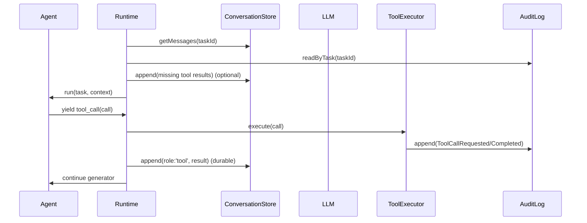

# LLM 上下文持久化与恢复

## 目标

- 会话重启/崩溃后，任务的 LLM 上下文可恢复并继续运行
- tool call 与 tool result 在历史中配对完整，避免模型出现“等待工具结果但结果缺失”的断裂
- reasoning 可选持久化，并在需要时参与上下文回传

## 持久化对象

- ConversationStore：每个 task 的 LLM 消息序列（system/user/assistant/tool）
  - Schema：见 [conversationStore.ts](file:///Users/yangjerry/Repo/coauthor/src/domain/ports/conversationStore.ts#L25-L44)
- AuditLog：工具执行的事实记录（ToolCallRequested/ToolCallCompleted）
  - Schema：见 [auditLog.ts](file:///Users/yangjerry/Repo/coauthor/src/domain/ports/auditLog.ts)

## 关键语义

- assistant 消息可以同时包含：
  - `content`：展示文本
  - `reasoning`：可选推理文本（用于诊断/恢复）
  - `toolCalls`：工具调用请求列表
- tool 消息必须包含：
  - `toolCallId`：与 toolCalls 中的 toolCallId 一一对应
  - `content`：工具输出（JSON 字符串或纯文本）

## 运行时恢复（Repair）

启动或恢复任务时，Runtime 会：

1. 从 ConversationStore 读取历史消息
2. 扫描历史中的 `assistant.toolCalls`
3. 对缺失对应 `tool` 消息的 toolCallId：
   - 若 AuditLog 中存在 `ToolCallCompleted`：将结果补写为 `role:'tool'` 消息（修复历史）
   - 若不存在 Completed 且工具为 safe：尝试重放执行一次并写回（仅 safe）
   - risky 工具不自动重放（需要 UIP 确认路径）

### 时序（简化）

## 流式输出约定

LLMStreamChunk 语义：

- `type:'text'`：每次 text-delta 直接产出
- `type:'reasoning'`：每次 reasoning-delta 直接产出
- `type:'tool_call_delta'`：每次 tool-input-delta 直接产出（原始增量字符串）

消费方可以通过字符串拼接得到完整文本/完整 arguments JSON。

## 监控与告警（最小可用）

通过 TelemetrySink 输出结构化事件（默认关闭，可在环境变量开启）：\n\n- `COAUTHOR_TELEMETRY_SINK=console`：stdout 输出 JSON（可被日志系统采集与告警）\n\n事件类型见 [telemetry.ts](file:///Users/yangjerry/Repo/coauthor/src/domain/ports/telemetry.ts)。

